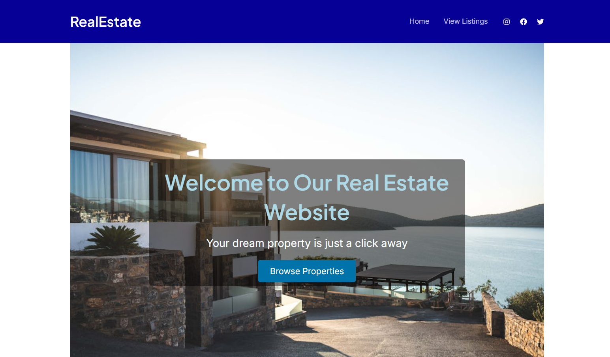

# Real Estate Property Listing Website using WordPress

This project is a **Real Estate Property Listing Website** built using **WordPress**. It showcases properties with dynamic filtering and custom styling. The website includes a **hero section** on the main page and displays properties in **custom cards** with key details like location, price, and a link to the individual property page in listing page.

## Features

- **Property Listings**: Display of properties in a card layout with details such as title, location, price, and a link to view more.
- **Filtering**: A form that allows users to filter properties by location and price. The filtering dynamically updates the displayed properties.
- **Responsive Design**: The website is mobile-friendly with a grid layout that adjusts based on the screen size, displaying a maximum of 3 properties per row.
- **WordPress Customization**: The site is built on the **Astra theme**, with custom modifications to support the real estate listing and filtering functionality.

## Screenshots



## What I Did

1. **WordPress Theme Customization**: I customized the Astra theme, adjusting its layout, structure, and functionality to suit the real estate property listing website requirements.
   
2. **Property Card Layout**: I created a custom layout for each property, ensuring it displays essential details such as title, location, price, and a link to more information.

3. **Property Filtering**: A dynamic filtering form was added to let users filter properties based on location and price. The filtering leverages **meta_query** in WordPress to search the custom fields associated with properties.

4. **Responsive Grid Layout**: The property cards are displayed in a grid format with a maximum of 3 cards per row, which adapts to different screen sizes, providing a user-friendly interface across devices.

5. **Custom CSS**: I wrote custom CSS to control the layout, spacing, and responsiveness of the site, including specific styles for the property cards and filter form.

## What I Learned

- **WordPress Theme Customization**: I deepened my understanding of WordPress theme customization by modifying the Astra theme using PHP and CSS.
  
- **WordPress Querying**: I learned how to utilize **WP_Query** and **meta_query** to filter posts dynamically based on custom fields, such as price and location.

- **Responsive Design Principles**: I learned how to implement a responsive design using CSS Grid, ensuring the layout adjusts appropriately on different devices.

- **PHP and WordPress Development**: I gained experience in working with WordPress’s backend, including handling custom fields and integrating dynamic content.

## How to Run the Project Locally

1. Clone the repository to your local machine:

   ```bash
   git clone https://github.com/AdnanRahmanpoor/real-estate-listing.git
   ```

2. Set up a local WordPress installation (e.g., using **XAMPP**, **Local by Flywheel**, or **MAMP**).

3. Upload the theme files into the `wp-content/themes/` directory of your local WordPress installation.

4. In the WordPress dashboard, activate the newly uploaded theme.

5. Configure the custom fields for properties (e.g., **Location** and **Price**) using the **Advanced Custom Fields (ACF)** plugin or by adding custom fields directly in the WordPress editor.

6. View the site locally by navigating to your WordPress instance and inspecting the property listings and filtering functionality.

